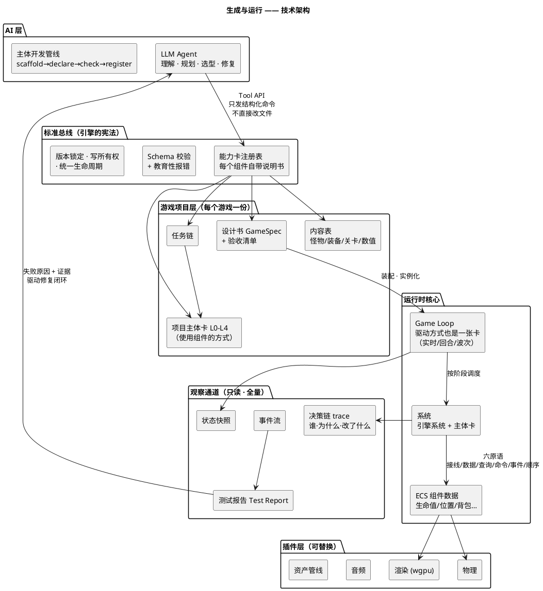

# AI 原生游戏引擎——设想总纲
> 本文是前期所有讨论的思路收拢：可行性分析、三份标准、竖切验证、以及关于任务链 / 模板 / 主体 / 联动的多轮问答。  
尽量少谈技术细节，多讲清"为什么这样想"，多举例子。技术细节见 `standards/` 下的规范文档。

---

## 1. 一句话愿景
> 用户用自然语言描述想要的游戏，Agent 在一个标准化的引擎环境里自主完成设计、选件、组装、试跑、修复；用户试玩、反馈，循环往复——**人负责目标、创意、审美、取舍，AI 负责实现、验证、修改的一切苦工。**

它不是"AI 帮你写代码的工具"，而是**重新定义 AI 时代的游戏引擎应该长什么样**：一个天然适合 AI 操作、同时人也能随时看懂和干预的游戏创造环境。

---

## 2. 生成一个游戏的完整旅程
```puml
@startuml 业务全景
title 从一句话到可玩游戏 —— 业务全景

start
:【用户】说出想法
例："做一个俯视角刷宝游戏，
暗黑地牢风格，单机";
:【Agent】引导式追问
视角？怎么操作？一局多久？什么美术？要多难?;
repeat
  :【Agent】复述理解 + 提建议;
  :【用户】确认 / 修正 / 补充;
repeat while (理解还有歧义?) is (是)
->否;

:【Agent】落地成「游戏设计书」
游戏名 · 故事背景 · 世界 · 角色 · 规则
+ 验收清单（什么算完成）;
note right
  例：验收条目
  "击杀哥布林后 1 秒内
   掉落至少 1 件物品"
end note
:【用户】审阅并批准
（AI 无权自己批准）;

:【Agent】选基础模板 · 拆插槽
世界 / 相机 / 主角 / 小怪 / Boss /
战斗 / 装备 / 掉落 / 背包;
note right
  模板是参考不是枷锁：
  槽位可增删，也可完全自建
end note

repeat
  :【框架】四道门检查;
  note right
    G1 结构完整：每个动作都有
     实体·规则·反馈三件套
    G2 双向咬合：每条验收有任务负责，
     每个任务有验收观测
    G3 接口推演：零件在纸面上就能拼上
    G4 里程碑递进：先能动、再能玩
  end note
backward :【Agent】带原因修订拆解;
repeat while (四道门未全过?) is (是)
->否;

:【框架】生成任务链
按依赖排序，切成里程碑;
note right
  M1 能动（引擎 + 主角 + 移动）
  M2 能玩（战斗 + 怪 + 掉落 + 拾取）
  M3 有深度（装备 + 成长 + 难度）
  M4 好看（资产 + 音效 + UI）
  M5 交付（性能 + 打包）
end note

repeat
  :取下一个任务（填一个槽）;
  if (组件库里有现成的?) then (是)
    :【Agent】检索推荐候选
    例：哥布林 3 款、骷髅兵 2 款;
    :【用户】挑选（也可交给 AI 默认）;
  else (否)
    :【Agent】按标准接口自定义开发
    注册成新组件，沉淀回库;
  endif
  :【Agent】调参数
  例：攻击范围 2.5→2.0 米、背包 20 格;
  note right
    默认值来自组件库；
    改动列成清单请用户确认
  end note
  :【引擎】接入运行 + 契约冒烟
  例：确认哥布林真的会发"死亡"事件;
repeat while (任务链还有未完成?) is (是)
->否;

repeat
  :【引擎】试运行：自动执行验收清单
  模拟按键 · 快进昼夜 · 截图 · 查状态;
  :【引擎】出测试报告
  哪条过/没过 · 原因 · 证据（日志/截图）;
backward :【Agent】读报告 → 提交修复计划
（框架校验 · 备份 · 可回滚）;
repeat while (仍有失败?) is (是)
->否;

:【用户】试玩;
if (满意?) then (是)
  :一个可玩的游戏;
  stop
else (否)
  :【用户】反馈
  例："Boss 太难""想要坐骑";
  :【Agent】改设计书 · 追加任务进链
  （回到装配与验收循环）;
  stop
endif
@enduml
```

### 2.1 对话阶段：收敛，不是记录
用户的描述千奇百怪——一句话、一段闲聊、"像 XX 游戏但是……"。Agent 的任务不是把聊天记录存档，而是**把模糊的愿望收敛成一份明确的「游戏设计书」**：游戏叫什么、什么背景、世界多大、有哪些角色和规则，以及一份**验收清单**——把"什么算做完"写成可检验的句子，例如"击杀哥布林后 1 秒内掉落至少 1 件物品"。

验收清单前置，是整个体系最重要的一步棋：后面所有自动验证都有锚点，AI 自己测自己也不会"既当运动员又当裁判"。

设计书有**批准闸**：AI 起草，用户拍板。改了关键验收或"明确不做"的边界，必须重新确认——人的监督落在流程上，不靠自觉。

### 2.2 拆解阶段：模板插槽，填空式选型
Agent 把设计书拆成一张**插槽清单**（这类游戏通常由什么组成）：3D 世界、俯视角相机、主角、小怪、Boss、战斗、装备、掉落、背包……可以从基础模板（如"俯视角刷宝"）起步省力，也可以增删槽位、甚至完全自建——**模板是参考不是枷锁**。

每个槽位三种填法：

| 填法 | 例子 |
| --- | --- |
| 库里检索，AI 推荐 | 暗黑地牢风的分块地图、哥布林、巨狼 Boss |
| 用户自己挑 | 主角在"卡通勇者"和"拟真剑士"之间二选一 |
| 自定义开发 | 库里没有装备系统 → 按标准接口开发，注册成新组件**沉淀回库** |

最后一种最有价值：**这个项目为它写的装备系统，下一个项目直接可用**。库随使用生长，这是引擎的护城河。

### 2.3 防跑偏：四道门
"用户描述千奇百怪，Agent 理解不能飘"——靠的不是把 Agent 捆死，而是**约束产物、不约束思维；设门、不铺轨道**。任务链开工前过四道机器检查：

+ **G1 结构完整**：每个玩家动作三件套齐全——有实体做（不是幽灵按键）、有规则管（按了有后果）、有反馈显（玩家看得见变化）。缺一样就是一类经典 bug
+ **G2 双向咬合**：每条验收都有任务负责实现，每个任务的产出都有验收在观测。删掉"夜刷怪"任务？门立刻拦下：验收 `夜晚会刷怪` 无人负责
+ **G3 接口推演**：整条链在纸面上拼一遍——任务要的事件有人发吗？要的组件前面产出了吗？专治"零件都好但拼不上"
+ **G4 里程碑递进**：任务排序保证每个里程碑完成时游戏都**处在可运行状态**——能动 → 能玩 → 有深度 → 好看 → 交付。"全部组装完才发现根本跑不起来"在结构上不可能

四道门检查的全是**形态**（闭合不闭合、对得上对不上），从不检查内容好坏——所以挡得住跑偏，挡不住创造。

### 2.4 装配阶段：组件 + 参数 + 主体
逐任务装配。每个任务 = 填一个槽：选件（或开发）、调参、接入冒烟。这里有一个关键问题的答案——**主角的属性谁决定？**

| 问题 | 谁决定 |
| --- | --- |
| 主角体积多大 | 选中的角色资产自带（换模型 = 换属性来源） |
| 攻击范围、伤害、背包容量 | 组件库给**默认值**，Agent 拟**覆写值**，用户**批准**生效 |
| 背包/装备里**有什么** | 内容层的数据（开局装备表） |
| **什么时候**出生 | 主体的编排逻辑（开局事件 → 出生） |
| **在哪儿**出生 | 场景里的出生点标记 |

一句话：**默认值来自复用，覆写值来自设计（要批准），动态行为来自编排，引擎只执行不决定。**

### 2.5 验证阶段：自动试跑 + 修复闭环
引擎自动执行验收清单：模拟按键、快进到夜晚、截图、查状态，产出**测试报告**——每条验收过没过、为什么、证据（日志/截图）。

这不是空想，已经实测过一轮（Nightfall Grove 生存小游戏）：夜晚刷怪验收失败 → 报告里的错误日志写着"订阅 event.night_begins 失败：事件不存在" → Agent 据此提交一行的修复计划（框架校验、备份、可回滚）→ 重跑全绿。**从发现到修复，全程无人碰代码文件。**

### 2.6 试玩阶段：体验回流
自动验收管"对不对"，管不了"好不好玩"。好玩与否最终要人试玩——"Boss 太难""想要坐骑"这类反馈，Agent 把它们落回设计书、追加任务进链，回到装配与验证循环。**趣味性是循环出来的，不是一次设计出来的。**

---

## 3. 五个关键问题的答案（讨论精华）
### Q1 光把组件组装起来，游戏是不是太简单了？
是。纯组件组装 = 乐高，天花板很低。所以游戏分**三层**：

+ **底座层**：跨项目复用的通用能力（移动、物理、渲染、背包……），从库里选
+ **主体层**：这个游戏独有的系统与编排——**创造性所在**。它不是"越过组件瞎写"，而是"使用组件的方式"：同样是哥布林 + 战斗 + 掉落，怎么编排仇恨、怎么设计掉落节奏，每个游戏不同
+ **内容层**：主体消费的数据（怪物表、装备表、关卡、数值），随时在改

多样性来自四个乘数：**用户描述 × Agent 拆槽 × 组件库 × 使用编排**。主体层也是标准件（有自己的说明书、能被验收、能回灌库），只是它属于这个项目。

### Q2 主体开发会不会失控？
主体开发走**受控流程**，是工具集合 + 框架，不是自由发挥区。表达力分五级（数据接线 → 声明式组合 → 受限表达式 → 沙箱脚本 → 宿主语言），**从最简单的级别起步，表达不了才降级**，降级是显式决策。大部分隐患（不确定、性能坑、崩溃面）在低级别**按构造不存在**。

### Q3 组件之间怎么联动？光靠事件机制行吗？
不够。事件只覆盖"某个瞬间发生了某事"这一种形态。完整答案是六个原语：

| 想表达 | 用什么 | 例子 |
| --- | --- | --- |
| 谁连着谁（装配期定死） | **接线** | 相机跟随主角 |
| X 现在是什么（持续状态） | **数据读** | 建造系统读背包木材数 |
| X 在哪 / 哪些满足条件 | **查询** | 12 米内最近的敌人 |
| 请做这件事、要结果 | **命令** | 战斗结算（护甲此刻还能减伤） |
| 某事发生了（事后通知） | **事件** | 敌人死亡 → 掉落 |
| 帧内谁先谁后 | **顺序** | HUD 在模拟之后刷新 |

一条分界线最重要：**命令是"将要发生"（可修改），事件是"已经发生"（只能反应）**。护甲减伤必须在命令结算里介入——等伤害事件发出来，血已经扣了。

### Q4 AI 会不会把项目改坏？
AI 从不直接改文件。一切改动走结构化计划：AI 提交"改哪里、为什么"，**框架**负责校验（越界路径拒绝、歧义匹配拒绝）、备份、应用、审计、回滚。改坏了？一条命令退回上一个状态。每个项目改动全程可追溯。

### Q5 这套东西现在到底验证到哪了？
已完成：三份引擎标准（能力卡 / 游戏设计书 / 观察与验收）+ 一个最小验收 Runner + 真实修复闭环实测（见 2.5）。**"从设计书到可玩游戏、失败自动定位修复"这条主干已经跑通过一次**，不是 PPT 架构。

---

## 4. 游戏如何运行


**生成侧**：Agent 不直接碰引擎内部，一切经标准总线——要什么能力，总线查注册表应答；叫错了名字，报错会告诉他"最接近的是什么"。项目层四件套（设计书/任务链/主体卡/内容表）装配成运行时。

**运行侧**：游戏循环推动一切——而且**运行方式本身是一张卡**（动作游戏实时跑、战棋回合推、塔防按波次）。系统和主体读写组件数据，交互只经六原语。

**观察侧**：运行中发生的一切——每次命令、每个事件、每笔数据写入——都被只读采集。这一帧发生了什么、谁决定的、为什么，事后全部可查。测试报告带着证据回流 AI 层，驱动修复——这就是"生成 → 运行 → 观察 → 评估 → 修复"的闭环。

用一个瞬间串起来：玩家按下攻击键 → 输入翻译成"攻击"**命令**（护甲还能介入结算）→ 战斗系统**查询**命中目标 → 结算写入生命值**数据** → 敌人死亡发**事件** → 掉落主体卡监听事件、查稀有度表、生成掉落物 → 相机靠**接线**持续跟随 → HUD 靠**顺序**最后刷新 → 全程被观察通道记录在案。

---

## 5. 几条不可动摇的原则
1. **AI 不直接改文件**——结构化命令 + 框架校验 + 可回滚
2. **批准闸**——设计书、关键改动，AI 拟稿、人拍板
3. **里程碑门不可拆**——AI 可以增删重排任务，不能绕过"每个里程碑可运行"
4. **约束产物、不约束思维**——四道门查形态闭合，不查创意
5. **一切皆可追溯**——设计有版本、改动有审计、运行有 trace、验收有证据
6. **库随使用生长**——自定义组件沉淀回库，越用越富
7. **先闭环、后扩张**——第一个小游戏跑通全链路，比堆十个半成品系统重要

---

## 6. 下一步
+ **GameSpec v0.2**：补齐讨论中发现的设计书缺口（故事背景、目标、动词、出生点、初始装备、主体层升格）
+ **观察 v0.2**：决策链 trace + 写所有权——AI 修复循环的命脉
+ **任务链 + 四道门标准**：把本文 2.2/2.3 节落成可执行的检查器
+ **主体开发框架**：先在竖切里把"夜刷怪"改造成走完整流程的主体卡，用真实案例校准工具形态
+ 长期：AI 试玩代理（模拟真实玩家探索、卡关、评价难度），编辑器，多项目库沉淀
